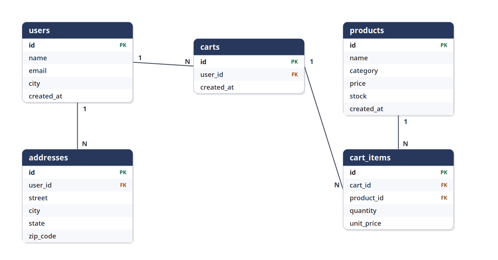
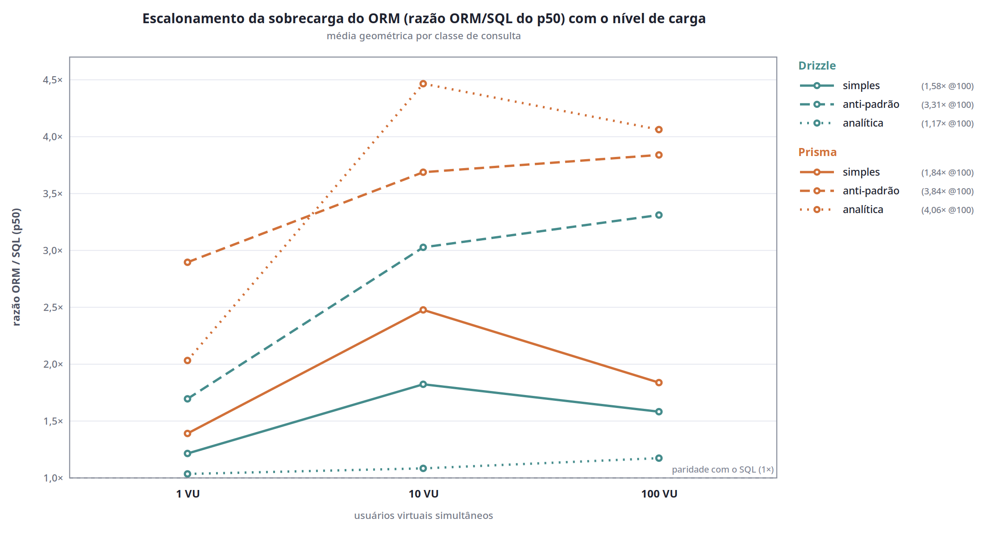
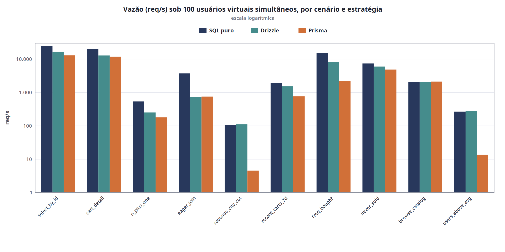

# Custo de Desempenho de ORMs em Consultas SELECT no PostgreSQL: uma comparação isolando a camada de abstração entre SQL puro, Drizzle e Prisma

**Eduardo Rossetti dos Santos Melo**

*Programa de Pós-Graduação em Ciência da Computação — Universidade Estadual Paulista "Júlio de Mesquita Filho" (UNESP)*
`eduardo.rossetti@unesp.br`

---

## Resumo

O Mapeamento Objeto-Relacional (ORM) é amplamente adotado para mediar a comunicação entre aplicações orientadas a objetos e bancos de dados relacionais, oferecendo conveniência de desenvolvimento ao custo de uma camada de abstração cujo impacto sobre o desempenho é frequentemente debatido, porém raramente isolado. Este trabalho compara o custo de desempenho de duas estratégias de ORM — Drizzle (query builder) e Prisma (ORM completo, em dois modos de carregamento de relações) — em relação ao acesso via SQL puro, restringindo-se a consultas SELECT sobre o PostgreSQL. Diferentemente de estudos anteriores, todas as estratégias compartilham o mesmo driver de banco (`pg`), de modo a isolar exclusivamente a camada de abstração e não o driver subjacente. A avaliação combina três camadas de medição — latência isolada (`bench.js`), latência sob carga concorrente (k6, com 1, 10 e 100 usuários virtuais) e análise de planos de execução (`EXPLAIN ANALYZE`) — sobre dez cenários representativos de três classes de consulta (simples, anti-padrão e analítica), em ambiente containerizado e com dados sintéticos determinísticos. Os resultados mostram que o overhead do ORM depende tanto da classe da consulta quanto do idioma adotado pela ferramenta: um query builder que emite SQL equivalente apresenta sobrecarga desprezível em consultas analíticas (≈1,2×), ao passo que um ORM que materializa o grafo de objetos em memória amplifica drasticamente sob carga, alcançando até 14× de sobrecarga em consultas analíticas com 100 usuários simultâneos. A análise de planos evidencia a causa: a decomposição de consultas em múltiplas requisições e o processamento de agregações na aplicação, em vez de no banco. Os achados auxiliam desenvolvedores na escolha consciente da estratégia de acesso a dados conforme o perfil de carga e o tipo de consulta predominante.

**Palavras-chave:** Mapeamento objeto-relacional; Desempenho; SQL; PostgreSQL; Node.js; Benchmark.

## Abstract

Object-Relational Mapping (ORM) is widely adopted to bridge object-oriented applications and relational databases, offering development convenience at the cost of an abstraction layer whose performance impact is frequently debated yet rarely isolated. This work compares the performance cost of two ORM strategies — Drizzle (query builder) and Prisma (full ORM, in two relation-loading modes) — against raw SQL access, restricted to SELECT queries on PostgreSQL. Unlike prior studies, all strategies share the same database driver (`pg`), so as to isolate the abstraction layer exclusively rather than the underlying driver. The evaluation combines three measurement layers — isolated latency (`bench.js`), latency under concurrent load (k6, with 1, 10, and 100 virtual users), and execution-plan analysis (`EXPLAIN ANALYZE`) — across ten scenarios representing three query classes (simple, anti-pattern, and analytical), in a containerized environment with deterministic synthetic data. Results show that ORM overhead depends on both the query class and the idiom adopted by the tool: a query builder that emits equivalent SQL exhibits negligible overhead on analytical queries (≈1.2×), whereas an ORM that materializes the object graph in memory amplifies drastically under load, reaching up to 14× overhead on analytical queries with 100 concurrent users. Plan analysis reveals the cause: query decomposition into multiple requests and aggregation performed in the application rather than in the database. The findings help developers make an informed choice of data-access strategy according to the load profile and the predominant query type.

**Keywords:** Object-relational mapping; Performance; SQL; PostgreSQL; Node.js; Benchmark.

---

## 1. Introdução

O Mapeamento Objeto-Relacional (*Object-Relational Mapping* — ORM) é um padrão consolidado para acesso a bancos de dados relacionais em sistemas orientados a objetos, permitindo que desenvolvedores manipulem dados por meio de construções da própria linguagem de programação, sem redigir manualmente as instruções em SQL (*Structured Query Language*) (NICOLETTI; MARÇAL, 2024). Sua principal vantagem é elevar o nível de abstração do acesso a dados: o foco do desenvolvimento desloca-se para o modelo de domínio, reduzindo o código repetitivo e facilitando a manutenção (OLIVEIRA et al., 2024). Não por acaso, ferramentas de ORM tornaram-se onipresentes no ecossistema de desenvolvimento *backend*, em particular no ambiente Node.js, onde bibliotecas como Prisma, Sequelize e Drizzle figuram entre os pacotes mais utilizados.

Essa conveniência, contudo, não é gratuita. A introdução de uma camada de mediação entre a aplicação e o banco de dados decorre de uma incompatibilidade estrutural conhecida como impedância objeto-relacional (*object-relational impedance mismatch*): o modelo orientado a objetos é hierárquico e navegacional, enquanto o modelo relacional é declarativo e baseado em conjuntos (*set-based*), de modo que ambos representam e percorrem dados de maneiras fundamentalmente distintas (IRELAND et al., 2009; TEIXEIRA, 2017). Para transpor essa lacuna, ferramentas de ORM geram consultas SQL automaticamente a partir de chamadas de métodos, e é precisamente nessa tradução que reside o custo de desempenho: o desenvolvedor passa a exercer pouco controle sobre a qualidade e a eficiência das consultas produzidas (NICOLETTI; MARÇAL, 2024). A literatura documenta uma série de anti-padrões recorrentes em consultas geradas por ORM — como o problema N+1, em que uma operação é decomposta em uma sucessão de consultas linha a linha, e a busca ansiosa (*eager fetching*) de dados desnecessários —, todos manifestações da impedância nos níveis de paradigma e linguagem (COLLEY; STANIER; ASADUZZAMAN, 2020).

Diversos estudos avaliaram empiricamente o desempenho de ORMs, e há consenso recorrente de que o acesso via SQL puro supera o acesso mediado por ORM em operações básicas (YUSMITA et al., 2025; COLLEY; STANIER; ASADUZZAMAN, 2020). Entretanto, três limitações enfraquecem a comparabilidade desses trabalhos. Primeiro, comparações que confrontam múltiplos ORMs frequentemente misturam o overhead da abstração com o overhead do *driver* de banco, pois cada ferramenta utiliza um driver distinto — um fator de confusão (*confounder*) que contamina a atribuição de causa. Segundo, boa parte dos estudos concentra-se em operações CRUD simples ou em médias agregadas, sem decompor o comportamento por classe de consulta nem investigar como a sobrecarga evolui sob carga concorrente. Terceiro, são raras as análises que recorrem ao plano de execução (*EXPLAIN ANALYZE*) como evidência causal do porquê de uma estratégia ser mais lenta que outra, limitando-se a reportar tempos sem explicá-los.

Este trabalho aborda essas lacunas comparando, de forma controlada, três estratégias de acesso a dados em consultas SELECT sobre o PostgreSQL: SQL puro (via *driver* `pg`), Drizzle (um *query builder*, que constrói SQL de forma programática sem mapear entidades) e Prisma (um ORM completo, avaliado em dois modos de carregamento de relações). A decisão metodológica central é submeter todas as estratégias ao **mesmo driver de banco** (`pg`), de maneira a isolar exclusivamente a camada de abstração e neutralizar o confound do driver presente em estudos anteriores. A avaliação articula-se em três camadas complementares de medição — latência isolada, latência sob carga concorrente com 1, 10 e 100 usuários virtuais, e análise de planos de execução —, aplicadas a dez cenários que cobrem três classes de consulta (simples, anti-padrão e analítica), em ambiente containerizado com geração sintética e determinística de dados, à maneira de Yusmita et al. (2025).

A pesquisa é norteada pela seguinte pergunta: *qual é o custo de desempenho de utilizar um ORM em vez de SQL puro em consultas SELECT no PostgreSQL, e de que modo esse custo varia conforme a classe da consulta e a carga concorrente?* A hipótese de trabalho é que a sobrecarga não é uniforme, mas depende tanto da classe da consulta quanto do idioma adotado pela ferramenta: espera-se que um *query builder* que emite SQL equivalente ao manual apresente sobrecarga modesta e estável, ao passo que um ORM que materializa o grafo de objetos em memória amplifique a sobrecarga sob carga, sobretudo em consultas analíticas e em anti-padrões. Os resultados confirmam essa hipótese e, mais que isso, identificam por meio dos planos de execução o mecanismo causal da degradação — a decomposição de consultas em múltiplas requisições e o deslocamento da agregação do banco para a aplicação.

O restante deste artigo está organizado como segue. A Seção 2 apresenta a fundamentação teórica sobre ORM e impedância objeto-relacional. A Seção 3 discute os trabalhos relacionados e posiciona a contribuição. A Seção 4 detalha a arquitetura experimental — ambiente, esquema de dados, cenários, métricas e o isolamento de processo adotado. A Seção 5 apresenta e discute os resultados, incluindo as ameaças à validade. Por fim, a Seção 6 traz as conclusões e os trabalhos futuros.

---

## 2. Fundamentação

### 2.1. Do driver ao ORM: um espectro de abstração

O acesso a um banco de dados relacional a partir de uma aplicação pode situar-se em diferentes níveis de abstração. No nível mais baixo está o *driver*, que executa instruções SQL escritas manualmente e devolve os resultados, oferecendo controle total ao custo de código repetitivo e acoplado ao banco. Em um nível intermediário situam-se os *query builders*, que constroem consultas SQL de forma programática e tipada, sem mapear entidades de domínio, emitindo tipicamente uma única consulta por operação. No nível mais alto encontram-se os ORMs completos, que mapeiam tabelas a objetos de domínio e expõem uma API declarativa, frequentemente apoiada por uma camada adicional de geração de consultas (NICOLETTI; MARÇAL, 2024). A principal vantagem do ORM é elevar o nível de abstração — o desenvolvimento concentra-se na modelagem do domínio, reduzindo a duplicação e facilitando a manutenção (OLIVEIRA et al., 2024); sua contrapartida é que, ao gerar consultas automaticamente, o desenvolvedor passa a exercer pouco controle sobre a qualidade e a eficiência do SQL produzido (NICOLETTI; MARÇAL, 2024).

### 2.2. Impedância objeto-relacional

A necessidade dessa camada de mediação decorre da impedância objeto-relacional — termo importado da engenharia elétrica para designar o atrito entre o modelo orientado a objetos e o relacional (TEIXEIRA, 2017). Os dois modelos são estruturalmente distintos: o orientado a objetos é uma rede de objetos interconectados, dotados de identidade e estado, percorrida por navegação; o relacional é declarativo e baseado em conjuntos, no qual cada tupla é uma afirmação sobre o domínio e toda operação resulta em uma nova relação (TEIXEIRA, 2017). Ireland et al. (2009) propõem um arcabouço conceitual que distingue quatro níveis de impedância — paradigma, linguagem, esquema e instância —, cada qual exigindo uma estratégia de mapeamento própria; estima-se que de 25% a 50% do código de uma aplicação objeto-relacional dedique-se a transpor essas incompatibilidades. O ORM é, portanto, o conjunto de estratégias que automatizam essa ponte.

### 2.3. Anti-padrões em consultas geradas por ORM

Justamente por gerar SQL automaticamente, ferramentas de ORM tendem a reproduzir um conjunto de anti-padrões reconhecidos na literatura (COLLEY; STANIER; ASADUZZAMAN, 2020). O mais citado é o problema N+1, em que uma operação que poderia ser resolvida com uma única consulta baseada em conjuntos é decomposta em uma sucessão de consultas linha a linha, elevando o número de acessos ao banco. Outro é a busca ansiosa (*eager fetching*) de colunas ou relações desnecessárias, que são trazidas à aplicação e depois descartadas. Soma-se a isso a tendência de favorecer subconsultas aninhadas em detrimento de junções (JOINs) e de evitar construções avançadas do SQL. Pela teoria relacional, consultas baseadas em conjuntos são preferíveis a acessos linha a linha por sua maior eficiência (COLLEY; STANIER; ASADUZZAMAN, 2020) — e é a violação desse princípio que caracteriza boa parte da sobrecarga atribuída aos ORMs.

### 2.4. O plano de execução como instrumento de análise

No PostgreSQL, como em qualquer SGBD relacional, o SQL é declarativo: o otimizador baseado em custo decide *como* executar uma consulta, produzindo um plano de execução. O comando `EXPLAIN ANALYZE` executa efetivamente a consulta e reporta a estrutura do plano (varreduras de índice ou sequenciais, tipos de junção), os tempos reais de planejamento e execução e o consumo de *buffers*. Comparar o plano e o número de consultas emitidas por uma estratégia de ORM com os de uma consulta escrita manualmente permite explicar *por que* uma é mais lenta que a outra, indo além do mero registro de tempos — um instrumento pouco explorado nos estudos comparativos de desempenho de ORMs.

## 3. Trabalhos Relacionados

A comparação de desempenho entre ORMs e SQL puro tem sido objeto de diversos estudos empíricos, com consenso recorrente de que o acesso direto supera o mediado por ORM. Yusmita et al. (2025) constituem a referência mais próxima deste trabalho: comparam SQL puro e o ORM Prisma sobre o PostgreSQL, em ambiente containerizado e com dados sintéticos gerados pela biblioteca *faker.js*, avaliando oito tipos de consulta por meio de um índice composto de tempo de execução, uso de CPU e memória e estabilidade; concluem que o SQL puro é até cinco vezes mais rápido e consome de seis a nove vezes menos CPU. Colley, Stanier e Asaduzzaman (2020) combinam uma pesquisa com administradores de banco e um experimento que confronta consultas escritas por especialista com as geradas pelo Django ORM, evidenciando anti-padrões e relatando um caso em que o ORM emite mais de mil consultas onde o SQL emprega uma única. No contexto brasileiro e em Node.js, Oliveira et al. (2024) comparam TypeORM, Prisma e Sequelize em operações CRUD sob carga gerada pelo k6, sobre um esquema de comércio eletrônico semelhante ao adotado aqui. No tocante à metodologia de avaliação sob carga, Couto et al. (2022) avaliam experimentalmente o PostgreSQL com usuários simultâneos e testes de estresse, incluindo uma análise de ameaças à validade que serve de referência. O rigor metodológico adotado apoia-se ainda em trabalhos de referência sobre *benchmarking* confiável (KALIBERA; JONES, 2013; BEYER; LÖWE; WENDLER, 2017; HASSELBRING, 2021).

A Tabela 1 posiciona este trabalho frente aos estudos comparativos mais próximos. Três lacunas justificam a contribuição. Primeiro, estudos que comparam múltiplos ORMs frequentemente os apoiam em *drivers* distintos, confundindo o overhead da abstração com o do driver (OLIVEIRA et al., 2024); ao unificar o driver, isolamos exclusivamente a camada de abstração. Segundo, a maioria reporta médias agregadas ou restringe-se a operações CRUD, sem decompor o comportamento por classe de consulta nem observar sua evolução sob diferentes níveis de carga. Terceiro, são raras as análises que empregam o plano de execução como evidência causal das diferenças observadas.

**Tabela 1 – Posicionamento frente aos trabalhos relacionados**

| Trabalho | Estratégias comparadas | Banco | Carga concorrente | Driver unificado | Plano de execução | Por classe de consulta |
|---|---|---|---|---|---|---|
| Yusmita et al. (2025) | SQL puro vs Prisma | PostgreSQL | Não (execução sequencial) | — (1 ORM) | Não | Parcial (8 tipos) |
| Colley et al. (2020) | SQL (especialista) vs Django ORM | SQL Server | Não | — (1 ORM) | Sim | Sim (5 objetivos) |
| Oliveira et al. (2024) | TypeORM, Prisma, Sequelize | PostgreSQL | Sim (k6) | Não (drivers distintos) | Não | Não (apenas CRUD) |
| Couto et al. (2022) | — (apenas o SGBD) | PostgreSQL | Sim (JMeter) | Não | n/a | Parcial (leitura/escrita) |
| **Este trabalho** | SQL puro, Drizzle, Prisma (2 modos) | PostgreSQL | Sim (k6: 1/10/100 VU) | **Sim (`pg`)** | **Sim (ANALYZE + contagem)** | **Sim (3 classes)** |

Fonte: elaboração própria.

## 4. Arquitetura Experimental

Esta seção descreve a arquitetura experimental adotada para avaliar o custo de desempenho das estratégias de acesso a dados. O delineamento privilegia a reprodutibilidade e o isolamento de variáveis: o ambiente é integralmente containerizado, os dados são gerados de forma determinística e cada estratégia é medida em isolamento de processo, conforme detalhado a seguir.

### 4.1. Ambiente de testes

Os experimentos foram executados em uma única máquina, de modo a eliminar a variabilidade de rede entre cliente e servidor. A configuração de hardware foi: processador AMD Ryzen 7 7700X (8 núcleos físicos, 16 *threads*), 32 GB de memória RAM e armazenamento em SSD NVMe (PCIe) de 1 TB; o sistema operacional foi o Ubuntu 26.04 LTS (kernel 7.0). O banco de dados PostgreSQL 17.9 (POSTGRESQL GLOBAL DEVELOPMENT GROUP, 2024) foi executado em contêiner Docker, com a extensão `pg_stat_statements` habilitada e as demais configurações mantidas em seus valores padrão. A aplicação executou sobre o Node.js 24, e a carga concorrente foi gerada com a ferramenta de teste de carga k6 (GRAFANA LABS, 2026), na versão 2.0. As versões das bibliotecas de acesso a dados foram fixadas (*pinned*) para garantir reprodutibilidade: `pg` 8.20 (driver), Drizzle ORM 0.45.2 e Prisma 7.8. O uso de contêineres assegura consistência de ambiente entre execuções e aproxima o experimento de cenários reais de produção, prática recomendada para benchmarks confiáveis (BEYER; LÖWE; WENDLER, 2017; YUSMITA et al., 2025).

### 4.2. Esquema relacional e geração de dados

O esquema de dados reproduz um domínio de comércio eletrônico, composto por cinco tabelas relacionadas: `users`, `addresses`, `products`, `carts` e `cart_items`, conforme o modelo entidade-relacionamento da Figura 1. As relações incluem chaves estrangeiras com integridade referencial (e exclusão em cascata) e índices secundários sobre as colunas mais consultadas (cidade do usuário, categoria do produto e as chaves estrangeiras de carrinhos e itens). O esquema é definido por um *script* SQL único, que constitui a fonte da verdade; o modelo do Prisma e o esquema do Drizzle apenas o espelham, sem recorrer a migrações automáticas, de modo a garantir que as três estratégias operem sobre estruturas idênticas.

**Figura 1 – Modelo entidade-relacionamento do esquema**



Fonte: elaboração própria.

Os dados foram gerados sinteticamente com a biblioteca *faker.js*, semeada com uma semente fixa (`faker.seed(12345)`), o que torna o conjunto de dados determinístico e reproduzível (YUSMITA et al., 2025). Para evitar uniformidade artificial, adotou-se uma distribuição assimétrica de carrinhos por usuário (média de aproximadamente 1,5 carrinho por usuário, com cerca de 30% dos usuários sem carrinho e uma cauda de compradores frequentes), e as datas de criação foram distribuídas ao longo dos 90 dias anteriores ao instante da geração. O volume final é de 10.000 usuários, 10.000 endereços, 1.100 produtos (dos quais 100 nunca vendidos, para suportar o cenário de produtos sem venda), 13.195 carrinhos e 46.018 itens de carrinho — totalizando cerca de 80 mil registros. Esse volume foi escolhido para que o tempo de processamento no PostgreSQL não dominasse a medição, tornando visível a sobrecarga da camada de abstração.

Entre cada medição, o estado do banco é restaurado a partir de um *snapshot* em formato CSV (via `TRUNCATE … RESTART IDENTITY CASCADE` seguido de `COPY`, `ANALYZE` e `CHECKPOINT`), prática padrão em *benchmarks* de banco de dados para garantir que cada execução parta de um estado idêntico e controlado.

### 4.3. Estratégias avaliadas

Foram avaliadas quatro estratégias de acesso a dados, todas operando sobre o **mesmo driver** `pg` (node-postgres). Essa uniformização é a decisão metodológica central do trabalho: ao manter o driver constante, isola-se exclusivamente o custo da camada de abstração, neutralizando o fator de confusão presente em estudos que comparam ORMs apoiados em drivers distintos. A Tabela 2 resume as estratégias.

**Tabela 2 – Estratégias de acesso a dados avaliadas**

| Estratégia | Tipo | Biblioteca | Caminho de acesso |
|---|---|---|---|
| `sql` | Driver direto (SQL puro) | pg 8.20 | `pool.query` com SQL e parâmetros (`$1, $2, …`) |
| `drizzle` | *Query builder* | Drizzle 0.45.2 | API programática que emite uma única consulta SQL |
| `prisma` | ORM completo (idiomático) | Prisma 7.8 | API declarativa; com `relationJoins`, carrega relações por *LATERAL JOIN* |
| `prisma-query` | ORM completo (modo legado) | Prisma 7.8 | idem, forçando o carregamento de relações por consultas separadas |

Fonte: elaboração própria.

A estratégia `sql` representa o limite inferior de sobrecarga (acesso direto ao driver). O Drizzle é um *query builder*: constrói SQL de forma programática, sem mapear entidades de domínio, e emite uma única consulta por operação. O Prisma é um ORM completo; avaliou-se sua versão idiomática (`prisma`), sem recurso a SQL bruto — para consultas que sua API declarativa não expressa nativamente, recorreu-se ao caminho natural da ferramenta, qual seja, recuperar os registros e processá-los na aplicação. Com a *preview feature* `relationJoins` habilitada, o Prisma carrega relações aninhadas por *LATERAL JOIN* em uma única consulta. A quarta estratégia, `prisma-query`, força o modo de carregamento legado (`relationLoadStrategy: 'query'`), no qual cada relação dispara uma consulta separada — permitindo contrastar, na mesma ferramenta, os dois mecanismos de carregamento.

### 4.4. Cenários e classes de consulta

A avaliação cobre dez cenários de consulta SELECT, agrupados em três classes que representam perfis distintos de acesso a dados (Tabela 2). As consultas de **escrita foram deliberadamente excluídas** do escopo, pois nelas o custo do ORM mistura-se à divergência da primitiva expressável (por exemplo, atualização em massa em uma consulta versus *N* atualizações em transação), o que confunde a atribuição do overhead à camada de abstração; além disso, operações de escrita produzem planos de execução triviais, pouco informativos para a análise causal pretendida. Cada cenário foi implementado de forma idiomática em todas as estratégias, e sua equivalência semântica foi verificada automaticamente antes da coleta (comparando contagem de linhas, identificadores e agregados, tomando o SQL puro como referência).

**Tabela 3 – Cenários por classe de consulta**

| Classe | Cenário | Padrão de consulta |
|---|---|---|
| Simples | `select_by_id` | busca por chave primária |
| Simples | `cart_detail` | JOIN de um nível com filtro de linha única |
| Anti-padrão | `n_plus_one` | 100 consultas seriais (uma por carrinho) |
| Anti-padrão | `eager_join` | mesmo resultado em uma única consulta (`IN` + LEFT JOIN) |
| Analítica | `revenue_by_city_and_category` | JOIN de 5 tabelas + GROUP BY + `SUM(a·b)` + COUNT DISTINCT + AVG |
| Analítica | `recent_carts_7d` | varredura por faixa em índice B-tree de *timestamp* + JOIN |
| Analítica | `frequently_bought_together` | auto-junção (*SELF-JOIN*) + GROUP BY + COUNT |
| Analítica | `products_never_sold` | `NOT EXISTS` correlacionado |
| Analítica | `browse_catalog_paginated` | CTE *top-N* + JOIN + paginação por `OFFSET` |
| Analítica | `users_above_avg_spending` | `HAVING` com subconsulta escalar |

Fonte: elaboração própria.

As consultas simples representam o caso de menor custo no banco, no qual a sobrecarga da camada de abstração tende a ser proporcionalmente mais visível. Os anti-padrões contrastam, propositadamente, uma implementação deficiente (`n_plus_one`, com 100 consultas seriais) com sua forma equivalente em consulta única (`eager_join`), permitindo observar como cada estratégia se comporta diante de um padrão reconhecidamente custoso. As consultas analíticas exercitam recursos do SQL — junções de múltiplas tabelas, agregações compostas, subconsultas escalares e funções de janela —, nos quais o tempo de processamento do banco é maior e, em princípio, dominante.

### 4.5. Métricas e protocolo de medição

A avaliação articula-se em três camadas complementares de medição, de modo a capturar o desempenho sob óticas distintas.

**Camada 1 — Latência isolada.** Mede-se o tempo de execução de cada cenário em um processo Node dedicado, sem servidor HTTP, executando 200 iterações medidas precedidas de 50 iterações de aquecimento (*warmup*) descartadas, com o banco restaurado entre cenários. Reporta-se a mediana e o 95º percentil, em consonância com a recomendação de privilegiar a mediana em medições de desempenho sujeitas a ruído (KALIBERA; JONES, 2013). Essa camada estabelece a latência de referência, livre de efeitos de concorrência.

**Camada 2 — Latência sob carga.** Cada estratégia é exposta por um servidor HTTP (Fastify) e submetida a carga concorrente gerada pelo k6, em três níveis de usuários virtuais simultâneos (1, 10 e 100 VUs), por 30 segundos cada. Para permitir a estimativa de dispersão entre execuções, cada combinação (estratégia × cenário × nível de VU) foi repetida em **três réplicas**, totalizando uma matriz de 4 × 10 × 3 × 3 = 360 execuções; reporta-se a mediana entre réplicas. Registram-se a latência (p50, p95), a vazão (requisições por segundo) e a taxa de erro, com um limiar de aceitação de menos de 1% de falhas.

**Camada 3 — Análise de planos.** Para investigar a *causa* das diferenças de desempenho, captura-se o SQL efetivamente emitido por cada estratégia (por interceptação do driver) e executa-se `EXPLAIN (ANALYZE, BUFFERS)` sobre cada consulta, reportando o tempo de planejamento e de execução no banco, bem como o **número de consultas** disparadas por operação. Essa última métrica é decisiva para evidenciar anti-padrões como a decomposição de uma operação em múltiplas consultas (COLLEY; STANIER; ASADUZZAMAN, 2020).

A métrica primária de comparação é a **razão de sobrecarga** (*overhead ratio*) entre cada ORM e o SQL puro (ORM/SQL); valores acima de 1× indicam que o ORM é mais lento. Para sumarizar por classe de consulta, utiliza-se a média geométrica das razões, mais apropriada do que a média aritmética para agregar fatores multiplicativos.

### 4.6. Isolamento de processo

Em testes preliminares, observou-se que carregar múltiplas estratégias em um mesmo processo Node introduzia viés sistemático sob carga concorrente: a estratégia baseada no driver puro sofria degradação substancialmente maior do que as demais, atribuível à contenção difusa no laço de eventos (*event loop*) de thread única quando múltiplos *pools* de conexão e bibliotecas de cliente operam em paralelo. Para mitigar esse efeito, **cada estratégia executa em um processo Node dedicado** durante o seu bloco de medição. Ademais, na matriz de carga o servidor é reiniciado a cada combinação (estratégia × cenário × nível de VU), de modo a impedir a contaminação cruzada entre cenários por meio de um *pool* de conexões eventualmente degradado. Esse cuidado corresponde diretamente ao requisito de *isolamento das execuções individuais* apontado como indispensável para benchmarks confiáveis (BEYER; LÖWE; WENDLER, 2017), e constitui, em si, um diferencial metodológico em relação a estudos que não controlam essa fonte de viés.

## 5. Resultados e Discussão

A matriz completa compreendeu 360 execuções de carga, além das medições de latência isolada e da análise de planos para as quarenta combinações de estratégia e cenário. A verificação de integridade das execuções foi satisfatória: das 360 células, 359 transcorreram sem qualquer falha de requisição; a única exceção é discutida na Seção 5.5 e constitui um artefato estatístico, não uma falha de medição. Os resultados são organizados das três camadas de medição para a evidência causal: primeiro a latência isolada (5.1), depois o comportamento sob carga (5.2), em seguida a explicação dos planos de execução (5.3) e, por fim, o efeito do modo de carregamento de relações (5.4).

### 5.1. Latência isolada

Na medição isolada (`bench.js`), o Drizzle mantém-se muito próximo do SQL puro em todas as classes: a sobrecarga é modesta nas consultas simples (1,38× em `select_by_id`; 1,40× em `cart_detail`) e praticamente desaparece nas analíticas, chegando a empatar com o SQL nos cenários em que o tempo do banco domina (0,99× em `revenue_by_city_and_category`; 1,00× em `browse_catalog_paginated`). Esse comportamento é coerente com a natureza de um *query builder*, que emite uma consulta SQL equivalente à manual.

O Prisma, por outro lado, já revela sobrecarga apreciável mesmo sem concorrência. Em consultas simples o custo é contido (1,56×–1,88×), mas cresce de forma acentuada no anti-padrão `eager_join` (6,02×) e nas analíticas que envolvem agregação — 3,87× em `revenue_by_city_and_category`, 3,12× em `users_above_avg_spending` e 2,39× em `frequently_bought_together`. Já em analíticas sem agregação na aplicação, como `products_never_sold` (1,16×), o Prisma permanece próximo do SQL. Esse contraste antecipa o mecanismo causal detalhado na Seção 5.3.

### 5.2. Latência sob carga

Sob carga concorrente, o padrão observado isoladamente amplifica-se, e de modo desigual entre as ferramentas. A Tabela 4 sintetiza a sobrecarga média (média geométrica das razões ORM/SQL) por classe de consulta e nível de carga; a Figura 2 traça a trajetória dessa sobrecarga ao longo dos três níveis de carga, e a Figura 3 apresenta a vazão por cenário sob 100 usuários virtuais.

**Tabela 4 – Sobrecarga média (geomean ORM/SQL do p50) por classe de consulta e carga**

| Estratégia / classe | bench | k6 @ 1 VU | k6 @ 10 VU | k6 @ 100 VU |
|---|---|---|---|---|
| Drizzle — simples | 1,39× | 1,22× | 1,82× | 1,58× |
| Drizzle — anti-padrão | 1,96× | 1,70× | 3,03× | 3,31× |
| Drizzle — analítica | 1,08× | 1,04× | 1,08× | 1,17× |
| Prisma — simples | 1,71× | 1,39× | 2,48× | 1,84× |
| Prisma — anti-padrão | 3,31× | 2,90× | 3,69× | 3,84× |
| Prisma — analítica | 2,27× | 2,03× | 4,47× | 4,06× |

Fonte: elaboração própria.

**Figura 2 – Escalonamento da sobrecarga (média geométrica da razão ORM/SQL do p50) por classe de consulta e nível de carga**



Fonte: elaboração própria.

A Figura 2 torna visível o achado central: as duas analíticas seguem trajetórias opostas. A do Drizzle (linha pontilhada) permanece rente à paridade com o SQL em qualquer carga (de 1,04× a 1,17×), ao passo que a do Prisma escala de 2,03× (1 VU) para 4,47× (10 VUs). As consultas simples de ambas as ferramentas formam um arco — sobem de 1 para 10 VUs e recuam a 100 VUs, quando o tempo do banco passa a dominar —, enquanto o anti-padrão cresce de forma monotônica com a carga nas duas ferramentas.

**Figura 3 – Vazão (req/s) sob 100 usuários virtuais simultâneos, por cenário e estratégia**



Fonte: elaboração própria.

Três observações sobressaem. Primeiro, o Drizzle preserva sobrecarga desprezível nas consultas analíticas mesmo sob carga máxima (1,17× em média a 100 VUs), confirmando que, quando o ORM emite o mesmo SQL, o custo da abstração dilui-se à medida que o tempo do banco domina. Segundo, o Prisma exibe o oposto na mesma classe: a sobrecarga analítica salta de 2,03× (1 VU) para 4,47× (10 VUs), e os casos extremos são drásticos — sob 100 VUs, a razão Prisma/SQL atinge **12,46× em `revenue_by_city_and_category`** (5 contra 105 req/s) e **13,82× em `users_above_avg_spending`** (14 contra 268 req/s), como se observa nas barras truncadas da Figura 3. Terceiro, no anti-padrão ambas as ferramentas amplificam sob carga (3,31× para o Drizzle e 3,84× para o Prisma a 100 VUs), o que indica que o ORM **não corrige** um padrão deficiente como o N+1 — ao contrário, agrava-o, por pagar o custo da abstração a cada uma das consultas seriais.

Esses resultados sustentam e refinam a hipótese do trabalho: a sobrecarga do ORM não é uniforme, mas depende **tanto da classe da consulta quanto do idioma da ferramenta**. Um *query builder* que delega a computação ao banco tem custo desprezível justamente onde mais importa em cargas analíticas; um ORM que materializa o grafo de objetos na aplicação inverte essa propriedade e degrada sob carga.

### 5.3. Evidência causal: planos de execução

A análise dos planos de execução explica os números acima. A Tabela 5 mostra o número de consultas SQL efetivamente emitidas por estratégia em cada cenário.

**Tabela 5 – Número de consultas SQL emitidas por operação (EXPLAIN)**

| Cenário | `sql` | `drizzle` | `prisma` | `prisma-query` |
|---|---|---|---|---|
| select_by_id | 1 | 1 | 1 | 1 |
| cart_detail | 1 | 1 | 1 | 2 |
| n_plus_one | 100 | 100 | 100 | 100 |
| eager_join | 1 | 1 | 1 | 3 |
| revenue_by_city_and_category | 1 | 1 | 1 | 7 |
| recent_carts_7d | 1 | 1 | 1 | 3 |
| frequently_bought_together | 1 | 1 | 2 | 3 |
| products_never_sold | 1 | 1 | 1 | 1 |
| browse_catalog_paginated | 1 | 1 | 2 | 2 |
| users_above_avg_spending | 1 | 1 | 2 | 2 |

Fonte: elaboração própria.

O SQL puro e o Drizzle emitem exatamente **uma** consulta por operação em todos os cenários (exceto o `n_plus_one`, deficiente por construção em qualquer estratégia), e os planos são estruturalmente idênticos — o que explica por que o Drizzle acompanha o SQL puro tão de perto. A degradação analítica do Prisma idiomático, contudo, **não** decorre de decomposição em múltiplas consultas: com `relationJoins`, ele emite uma única consulta com *LATERAL JOIN*. A causa é outra: em cenários como `revenue_by_city_and_category` e `users_above_avg_spending`, a API declarativa do Prisma não expressa a agregação composta (somas de produtos, médias de somas, contagens distintas), de modo que o caminho idiomático recupera **todos** os registros pertinentes (dezenas de milhares de linhas) e realiza a agregação em JavaScript, em vez de delegá-la ao banco. Sob concorrência, esse processamento na aplicação — somado à serialização do grande volume de dados — satura o laço de eventos, produzindo a latência de mais de 11 segundos observada a 100 VUs. É um mecanismo distinto, porém complementar, do clássico anti-padrão de decomposição em *N* consultas relatado na literatura, em que um ORM chega a emitir mais de mil consultas onde o SQL emprega uma (COLLEY; STANIER; ASADUZZAMAN, 2020).

O Quadro 1 evidencia esse mecanismo no cenário `users_above_avg_spending`. O SQL puro e o Drizzle emitem uma única consulta na qual a agregação composta (`SUM`, `AVG`, `HAVING`) e o recorte (`ORDER BY ... LIMIT 50`) são resolvidos pelo banco; o plano correspondente combina um `HashAggregate` com um `top-N heapsort` e **devolve apenas 50 linhas** à aplicação, em 39,5 ms de execução no banco. O Prisma idiomático, por não dispor de API declarativa para essa agregação, emite uma primeira consulta sem qualquer `SUM` ou `GROUP BY`, que materializa **as 46.018 linhas** de itens (plano `Nested Loop Left Join`), e uma segunda consulta apenas para recuperar os nomes dos 50 usuários já selecionados em JavaScript. A varredura em si custa modestos 27 ms no banco, mas é a transferência e a agregação desse volume na aplicação que, sob concorrência, produzem a latência de p50 superior a 11 s observada a 100 VUs.

**Quadro 1 – SQL emitido em `users_above_avg_spending`: agregação no banco (SQL/Drizzle) vs. materialização em JavaScript (Prisma)**

```sql
-- (a) SQL puro e Drizzle — 1 consulta; agregação resolvida no banco:
SELECT u.id, u.name, SUM(ci.quantity * ci.unit_price) AS spent
FROM users u
  JOIN carts      c  ON c.user_id = u.id
  JOIN cart_items ci ON ci.cart_id = c.id
GROUP BY u.id, u.name
HAVING SUM(ci.quantity * ci.unit_price) > (
         SELECT AVG(s.spent) FROM (
           SELECT SUM(ci.quantity * ci.unit_price) AS spent
           FROM cart_items ci JOIN carts c ON c.id = ci.cart_id
           GROUP BY c.user_id) s)
ORDER BY spent DESC
LIMIT 50;
-- Plano: HashAggregate (Group Key: u.id) + top-N heapsort -> 50 linhas retornadas

-- (b) Prisma idiomático — 2 consultas; nenhuma agregação em SQL:
-- consulta 1: materializa TODOS os itens (sem SUM/GROUP BY/HAVING):
SELECT t0.id, t0.quantity, t0.unit_price,
       cart  -- via LEFT JOIN LATERAL sobre carts (jsonb_build_object)
FROM cart_items AS t0
  LEFT JOIN LATERAL (
    SELECT jsonb_build_object('userId', t1.user_id)
    FROM carts AS t1 WHERE t0.cart_id = t1.id LIMIT 1) AS cart ON true;
-- Plano: Nested Loop Left Join -> 46.018 linhas retornadas
-- (soma por usuário, média, HAVING, ordenação e LIMIT 50 refeitos em JavaScript)

-- consulta 2: busca os nomes dos 50 usuários já selecionados na aplicação:
SELECT t0.id, t0.name FROM users AS t0 WHERE t0.id IN ($1, ..., $50);
```

Fonte: elaboração própria, a partir de `results/explain/{sql,drizzle,prisma}_users_above_avg_spending.md`.

Esse anti-padrão de decomposição manifesta-se justamente na variante `prisma-query`, que emite 7 consultas em `revenue_by_city_and_category` e 3 em `eager_join` e `recent_carts_7d`, onde as demais estratégias empregam uma só.

### 5.4. Efeito do modo de carregamento de relações

A comparação entre o Prisma idiomático (`prisma`, modo `join`) e sua variante legada (`prisma-query`, modo `query`) revela um **cruzamento dependente da carga**, sintetizado na Tabela 6. Em isolamento (1 VU), o modo `query` — que dispara *N* consultas simples — chega a ser **mais rápido** que o *LATERAL JOIN* (0,59× em `recent_carts_7d`; 0,64× em `eager_join`), pois várias consultas leves podem custar menos que uma junção lateral em baixa cardinalidade. Sob 100 VUs, entretanto, a relação se inverte: o modo `query` torna-se de 32% a 52% mais lento, à medida que o custo de *N* idas ao banco se amplifica com a concorrência.

**Tabela 6 – Modo `join` (relationJoins) vs. modo `query` no Prisma — razão `query`/`join` do p50**

| Cenário | `join` p50 isolado (ms) | `query` p50 isolado (ms) | razão @ 1 VU | razão @ 100 VU |
|---|---|---|---|---|
| cart_detail | 0,276 | 0,368 | 1,29× | 1,52× |
| eager_join | 3,773 | 2,424 | 0,64× | 1,45× |
| revenue_by_city_and_category | 314,1 | 263,9 | 0,84× | 1,40× |
| recent_carts_7d | 3,644 | 2,128 | 0,59× | 1,40× |
| frequently_bought_together | 0,948 | 1,071 | 1,15× | 1,32× |

Fonte: elaboração própria.

A implicação prática é que o carregamento por *LATERAL JOIN*, padrão da *preview feature* `relationJoins`, é a escolha adequada para cargas concorrentes, embora possa parecer desvantajoso em medições isoladas — um exemplo de como conclusões obtidas sem concorrência podem não se sustentar em produção.

### 5.5. Ameaças à validade

Algumas ameaças à validade devem ser consideradas na interpretação dos resultados.

**Pareamento de parâmetros sob carga.** No `bench.js`, os parâmetros de cada cenário são gerados de forma determinística; sob o k6, embora a semente do gerador seja fixada na inicialização do servidor, a ordem de chegada das requisições com usuários virtuais concorrentes é não-determinística, impossibilitando o pareamento exato requisição a requisição entre estratégias. Como a métrica reportada é a mediana sobre milhares de requisições em 30 segundos, eventuais assimetrias de sequência diluem-se na agregação.

**Dependência temporal.** O cenário `recent_carts_7d` filtra registros dos últimos sete dias relativamente ao instante de execução; como as datas dos dados sintéticos são ancoradas no momento da geração, o *snapshot* foi regenerado imediatamente antes da matriz, garantindo que a janela contivesse dados representativos.

**Execução em máquina única.** Cliente (k6) e servidor compartilham a mesma máquina, o que pode introduzir contenção entre o gerador de carga e a aplicação sob 100 VUs. Optou-se por essa configuração para eliminar a variabilidade de rede; ademais, como a métrica primária é a razão entre estratégias — todas sujeitas à mesma contenção —, o viés afeta o numerador e o denominador de forma comparável.

**Artefato no health-check.** Uma única célula (`prisma`/`revenue_by_city_and_category`/100 VUs) acusou violação do limiar de erro, porém com **taxa de falha real nula**: a latência da ordem de 11 segundos faz com que pouquíssimas iterações se completem na janela de 30 segundos, tornando a métrica de taxa de erro estatisticamente frágil em uma das réplicas. Trata-se de consequência da própria lentidão do Prisma nesse cenário — um achado — e não de defeito do procedimento.

**Generalização.** Avaliou-se uma versão de cada ferramenta sobre o PostgreSQL e o Node.js; resultados podem variar com outras versões, bancos ou cargas. Como o Drizzle é uma das abstrações mais leves (um *query builder* sem mapeamento de entidades), sua sobrecarga pode ser lida como um **limite inferior** para o overhead de ORMs em geral; e o Prisma foi avaliado em seu uso idiomático, representando a prática recomendada pela ferramenta. Por fim, a concordância entre as medições isoladas (`bench`) e sob 1 VU (k6) reforça a validade interna do procedimento de isolamento de processo.

## 6. Conclusões

Este trabalho investigou o custo de desempenho de utilizar um ORM em vez de SQL puro em consultas SELECT no PostgreSQL e como esse custo varia conforme a classe da consulta e a carga concorrente. A principal decisão metodológica — submeter todas as estratégias ao mesmo *driver* (`pg`) — permitiu isolar a camada de abstração e atribuir a ela, e não ao driver, as diferenças observadas; e a combinação de três camadas de medição com a análise de planos de execução possibilitou não apenas quantificar, mas explicar a sobrecarga.

Os resultados confirmam e refinam a hipótese inicial: **a sobrecarga do ORM depende tanto da classe da consulta quanto do idioma da ferramenta**. O Drizzle, um *query builder* que emite SQL equivalente ao manual, apresenta sobrecarga modesta e, sobretudo, desprezível nas consultas analíticas mesmo sob carga máxima (1,17× em média a 100 VUs), pois delega a computação ao banco. O Prisma, em sua forma idiomática, inverte essa propriedade: por materializar o grafo de objetos e realizar agregações na própria aplicação, amplifica drasticamente sob carga, alcançando 12 a 14 vezes a latência do SQL puro em consultas analíticas a 100 usuários simultâneos. A análise dos planos de execução revelou que essa degradação tem duas origens distintas — o processamento de agregações em memória, no caso idiomático, e a decomposição de uma operação em múltiplas consultas, no modo de carregamento legado. Observou-se ainda que o ORM **não corrige** anti-padrões como o N+1, mas os agrava, e que o carregamento de relações por *LATERAL JOIN* (padrão da *preview feature* `relationJoins`) é vantajoso sob carga, ainda que possa parecer custoso em medições isoladas.

Desses achados decorrem recomendações práticas. A conveniência do ORM custa mais caro justamente onde tende a ser mais necessária — em consultas analíticas sob alta concorrência —, de modo que aplicações sensíveis a desempenho nesse perfil beneficiam-se de um *query builder* ou de SQL puro para suas consultas críticas. Ao se optar por um ORM completo, convém preferir o carregamento por junção para cargas concorrentes e evitar delegar à aplicação agregações que o banco realiza de forma muito mais eficiente. Como o Drizzle representa uma das abstrações mais leves, sua sobrecarga pode ser interpretada como um limite inferior para o custo de ORMs em geral.

Como trabalhos futuros, pretende-se estender a avaliação a outras versões e a outros SGBDs, incorporar operações de escrita em análise dedicada, aprofundar a inspeção de consumo de *buffers* e de E/S, e contemplar a dimensão qualitativa da experiência de desenvolvimento e da manutenibilidade, que pondera, do outro lado da balança, os benefícios que justificam a adoção dos ORMs (YUSMITA et al., 2025).

## Referências

BEYER, Dirk; LÖWE, Stefan; WENDLER, Philipp. Reliable benchmarking: requirements and solutions. **International Journal on Software Tools for Technology Transfer**, v. 21, n. 1, p. 1–29, 2017.

COLLEY, Derek; STANIER, Clare; ASADUZZAMAN, Md. Investigating the Effects of Object-Relational Impedance Mismatch on the Efficiency of Object-Relational Mapping Frameworks. **Journal of Database Management**, v. 31, n. 4, p. 1–23, 2020.

COUTO, Herderson; SILVA, Francisco Airton; CALLOU, Gustavo; ANDRADE, Ermeson. Uma Abordagem Experimental para Avaliar o Desempenho do Banco de Dados Open-Source PostgreSQL. In: ESCOLA REGIONAL DE INFORMÁTICA DE GOIÁS, 10., 2022. **Anais [...]**. Porto Alegre: SBC, 2022. p. 12-23. DOI: https://doi.org/10.5753/erigo.2022.227314.

GRAFANA LABS. **k6: a modern load testing tool**. 2026. Disponível em: https://grafana.com/docs/k6/. Acesso em: jun. 2026.

HASSELBRING, Wilhelm. Benchmarking as Empirical Standard in Software Engineering Research. In: EVALUATION AND ASSESSMENT IN SOFTWARE ENGINEERING (EASE 2021), 2021, Trondheim. **Proceedings** [...]. New York: ACM, 2021. p. 365–372.

IRELAND, Christopher; BOWERS, David; NEWTON, Michael; WAUGH, Kevin. A Classification of Object-Relational Impedance Mismatch. In: FIRST INTERNATIONAL CONFERENCE ON ADVANCES IN DATABASES, KNOWLEDGE, AND DATA APPLICATIONS (DBKDA), 2009. **Proceedings** [...]. [S.l.]: IEEE, 2009. p. 36–43.

KALIBERA, Tomas; JONES, Richard. Rigorous Benchmarking in Reasonable Time. In: INTERNATIONAL SYMPOSIUM ON MEMORY MANAGEMENT (ISMM '13), 2013, Seattle. **Proceedings** [...]. New York: ACM, 2013. p. 63–74.

NICOLETTI, Maria do Carmo; MARÇAL, Denilson Silva. Mapeamento Objeto-Relacional – Considerações sobre a Ferramenta Ponte entre Programação Orientada a Objetos e Base de Dados Relacional. **Anais do WCF**, v. 11, p. 17–22, 2024.

OLIVEIRA, Eduardo Aparecido de; SOUZA, Vinicius Aparecido De; JUNGERS, Vinicius Cardoso; CODO, Fabio. Comparação de Desempenho entre os ORMs TypeORM, Prisma e Sequelize em Aplicações Node.js. **Revista e-F@tec**, v. 14, n. 2, 2024.

POSTGRESQL GLOBAL DEVELOPMENT GROUP. **PostgreSQL 17 Documentation**. 2024. Disponível em: https://www.postgresql.org/docs/17/. Acesso em: jun. 2026.

TEIXEIRA, Marcelo Heitor. Impedância objeto relacional: o atrito natural entre os dois mundos. **Tecnologia em Projeção**, v. 8, n. 1, p. 11–20, 2017.

YUSMITA, Joseph Christian; ARYA, Ronald; WIJAYA, Jason Manuel; SURYANINGRUM, Kristien Margi; SISWANTO, Ricky Reynardo. Optimizing Database Access Strategy: A Performance Analysis Comparison of Raw SQL and Prisma ORM. **Procedia Computer Science**, v. 269, p. 1201–1210, 2025.

## Apêndice A — Reprodutibilidade

O conjunto completo de resultados por cenário e nível de carga (latência p50/p95, vazão e taxa de erro) encontra-se consolidado em `results/consolidated.{csv,md}`, e os planos de execução individuais em `results/explain/`. O ambiente é provisionado via Docker, todas as versões de bibliotecas estão fixadas em `package-lock.json` e a geração de dados é determinística (`faker.seed(12345)`), garantindo a reprodutibilidade dos experimentos.

**Preparação do ambiente:**

```bash
nvm use                 # Node 24
npm install             # pg + drizzle + prisma + fastify + faker
npx prisma generate     # gera o cliente Prisma (uma vez, após o install)
npm run db:up           # sobe o PostgreSQL 17.9 em Docker
npm run seed            # popula o banco via faker (seed = 12345)
npm run db:snapshot     # exporta o snapshot CSV para reset rápido
```

**Execução da matriz completa** (4 estratégias × 10 cenários × 3 níveis de VU × 3 réplicas = 360 execuções de carga, mais a latência isolada e os planos; ~3h não assistidas):

```bash
npm run db:reset-fast && \
npm run bench:full && \
REPLICAS=3 npm run loadtest:matrix && \
npm run analyze && \
npm run consolidate
```
